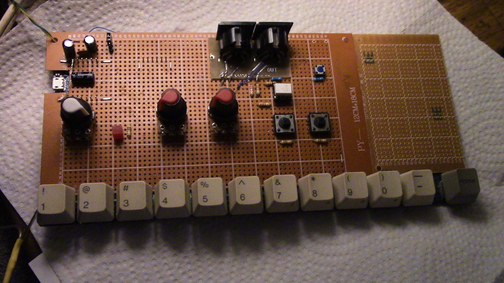

# ESP-909
Building upon Jan Ostman's Arduino IDE drum machine codebase for the ESP8266.  
Archive.org link: https://web.archive.org/web/20190917184506/http://blog.dspsynth.eu/audio-hacking-on-the-esp8266/

A work in progress - but it does work as a drum machine.  
The project uses a Wemos D1 Mini (ESP8266) and a 16 port 4067 multiplexer.  
Thanks to Jack Wildchurch for the usability emphasis!

Currently -  
All 11 TR-909 sounds at 44.1kHz  
2 different user creatable patterns at a pot selected tempo  
16th's pattern length  
Live mode and Record mode   
LED BPM and Live mode indicator  
Play/Pause button  
Tap tempo  
Metronome, with on and off  
Pattern Change (button on right side end of drum buttons)  
Pattern Copy, from pattern 1 to pattern 2  
Pattern Chain, add pattern 2 to the end of pattern 1  
Beat delete, by pressing the same drum button at the same pattern location  
Swing - crudimentarily implemented with a pot for now. Intention is to follow Roger Linn's % method  
Reset button (GND and RST) Surprisingly handy during a session  
MIDI Out - Tempo/Start/Stop  
MIDI PPQN change, for devices with different clock timings.   
Also, the drum pads allow playing nearly an octave of notes on a connected device. Handy for things with no keyboard.  
81% prog memory used - other old skool drumkits are intended to be able to be used in a future update  

Fritzing or similar schematic to be uploaded.  
A quick guide Manual has been uploaded (to be lightly updated and converted to PDF).  
Code is commented.  
Demo short track - FirstMIDI.mp3 is a quick demo of the sound of ESP-909, straight after getting MIDI to work. Recorded live to a Zoom R8 with no EQ. Sequence - JU-06A, Synth line - Korg X5DR  :)

