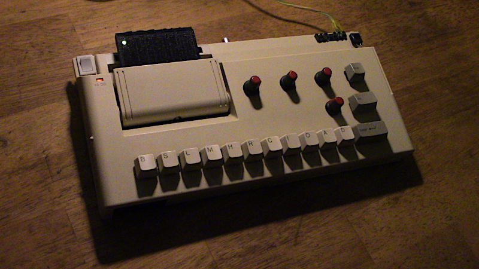
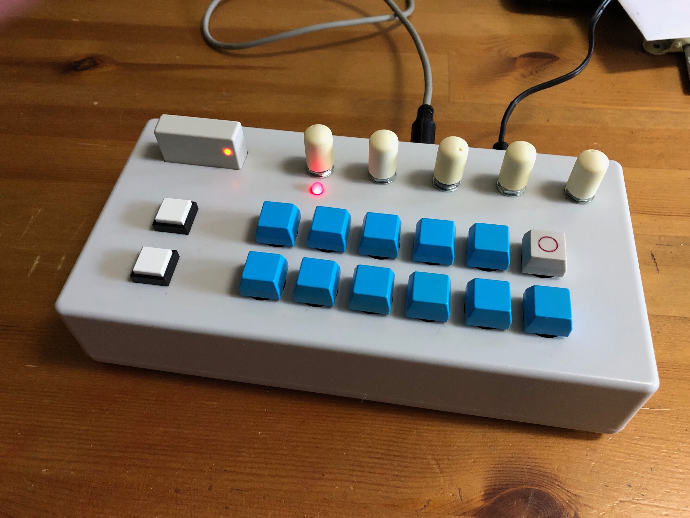

# ESP-909 Evolution
Building upon Jan Ostman's Arduino IDE drum machine codebase for the ESP8266.  
Archive.org link: 
https://web.archive.org/web/20190917184506/http://blog.dspsynth.eu/audio-hacking-on-the-esp8266/  

Download ESP-909.zip for the ESP8266 and Arduino code  
Download Drum Machines.zip for various alternative sample sets  
The 3 branches of the project contain this main code page, a builds area and a sound demo's area.
 

The project uses -  
Wemos D1 Mini (ESP8266)  
16 port 4067 multiplexer  
MAX98357A DAC  
Any Arduino (for handling MIDI messages)  

Currently -  
All 11 TR-909 sounds at 44.1kHz - and many other classic drum machines can be added  
2 different user creatable patterns at a pot selected tempo  
16th's pattern length  
Live mode and Record mode   
LED BPM and Live mode indicator  
Tap tempo  
Metronome, with on and off  
Pitch shifting, on the fly  
Pattern Change, on the fly  
Pattern Copy, from pattern 1 to pattern 2  
Pattern Chain, add pattern 2 to the end of pattern 1  
Pattern Save and Load - saving up to 4 drum sounds, per step, on both patterns!  
Beat delete, by pressing the same drum button at the same pattern location  
Swing - crudimentarily implemented. Intention is to follow Roger Linn's % method  
Play through - play drum sounds over the top of a pattern, without recording them  
Reset button (GND and RST) Surprisingly handy during a session  
MIDI Out - Start/Clock/Stop. Tested using Roland JU-06A, Arturia MicroBrute, Roland TB-03, BOSS DR-550 and more 
MIDI PPQN change, for devices with different clock timings.   
 
Other old skool drumkits can be exchanged in Drums.h  

More drum kits - Drum Machines.zip  
It contains replacement Drums.h files for TR-909, TR-808, TR-727, TR-707, TR-606, Drumtraks, DMX, CR-78 and LM-1  
Fresh additions - Drumulator, SP-12 and a Ludwig vintage real drumkit!
 
 
Fritzing or similar schematic to be uploaded.  
A quick guide Manual has been uploaded (to be converted to PDF)  
Code is commented, with full connections listed.   
Demo's can be found in the Sound-demo's Branch -  
FirstMIDI.mp3 is a quick demo of the sound of ESP-909, straight after getting MIDI to work  
Simulation.mp3 salutes William Shatner's trip into space aboard the Blue Origin spaceship. It uses a TR-808 sample set and no DAC 
Various classic machines drum kit examples can also be heard, as implemented on ESP-909  

   

Thanks to Jack Wildchurch for the cartridge idea and code testing!  
Here is his very cool build of an ESP-909 Evolution 

   

